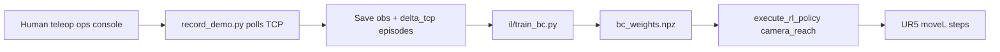

# Imitation Learning (Behavior Cloning)

Record how **you** move the arm, then train a policy that copies those motions at deploy time. This is the leader/follower style path without needing a second robot arm — you teleop on the same UR5 via the ops console or pendant.

Works with the same deploy path as RL: `execute_rl_policy` + `camera_reach` (full 3D target from depth).

## Pipeline



### What gets recorded

| Field | Meaning |
|-------|---------|
| `obs` (12) | joints(6) + tcp_xyz(3) + target_xyz(3) |
| `action` (3) | Human TCP delta `[dx, dy, dz]` between polls |
| `target_xyz` | From camera depth + hand-eye (or `--target` fixed) |

## 1) Prerequisites

- Hand-eye file: `data/calibration/hand_eye.json` (see [RL.md](RL.md))
- Ops console running for teleop: `python3 scripts/run_ops_console.py`
- Object visible to camera if using `--target-label`

## 2) Record demos

Terminal A — ops console (manual control):

```bash
cd ur5_agent && source robot_env/bin/activate
python3 scripts/run_ops_console.py
```

Terminal B — recorder (while you move the arm toward the object):

```bash
cd ur5_agent && source robot_env/bin/activate
python3 scripts/record_demo.py --live --target-label cup --duration-sec 90
```

Fixed target (no camera):

```bash
python3 scripts/record_demo.py --live --target 0.35,0.00,0.32 --duration-sec 60
```

Episodes save to `data/demos/reach/demo_*.json`. Record **3–10** episodes for a first BC model.

## 3) Train behavior cloning

```bash
python3 il/train_bc.py --task-id reach_bc --version v1
```

Output: `data/models/policies/reach_bc_v1/bc_weights.npz`

## 4) Deploy (same tool as RL)

```bash
python3 scripts/run_rl_policy_once.py --live \
  --task-id camera_reach \
  --target-label cup \
  --steps 20 \
  --max-step-m 0.005 \
  --policy-path ../data/models/policies/reach_bc_v1
```

Policy source in trace will show `"bc"` when the cloned policy runs.

## RL vs BC in this project

| | Sim RL (`train_reach.py`) | BC (`record_demo` + `train_bc.py`) |
|--|---------------------------|-------------------------------------|
| Teacher | Reward in sim | **You** (human teleop) |
| Data | Millions of sim steps | Tens–hundreds of real transitions |
| Best for | Pipeline test, known targets | **Lab reach style**, camera targets |
| Deploy | `policy.zip` (PPO) | `bc_weights.npz` |

You can use either checkpoint in `execute_rl_policy`; `ReachPolicyRunner` auto-detects format.

## Tips

- Use **small** ops-console steps (1–2 cm) for smooth demos.
- Keep scenes similar between record and deploy (lighting, object position).
- Re-record if you change camera mount — update hand-eye calib too.
- BC is a baseline (ridge regression). For harder tasks, upgrade to MLP/diffusion later.
