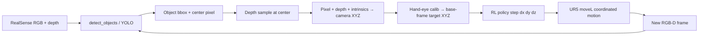

# Reinforcement Learning

This project uses **full 3D reach** for camera-guided tasks: depth + hand-eye calibration produce a target in robot base frame (X, Y, Z meters). RL then closes the gap with small Cartesian steps.

See also: [SIM_VLA_RL.md](SIM_VLA_RL.md) (Isaac + VLA full stack), [IL.md](IL.md) (human demos).

## Architecture (full 3D camera reach)



### Per-step detail

1. **RGB-D capture** — aligned color + depth (`RealSenseCamera.capture_rgbd`).
2. **Detection** — YOLO/contour → bbox + center `(u, v)`.
3. **Depth** — median depth at center pixel → `depth_m`.
4. **Deproject** — `(u, v, depth)` + intrinsics → point in camera frame.
5. **Transform** — hand-eye calibration → `target_base_m` in UR5 base frame (true 3D, height not fixed).
6. **RL** — `ReachPolicyRunner` (PPO checkpoint or proportional fallback) outputs `[dx, dy, dz]`.
7. **Execute** — `move_tcp_relative` → UR5 `moveL` (all joints coordinated).
8. **Loop** — re-detect each step until distance &lt; `REACH_DONE_DIST_M` (default 8 mm).

## Components

| Piece | Path |
|-------|------|
| State reach sim | `ur5_agent/rl/envs/reach_env.py` |
| Train / eval | `ur5_agent/rl/train_reach.py`, `eval_reach.py` |
| 3D geometry | `ur5_agent/camera/geometry.py` |
| RGB-D camera | `ur5_agent/camera/realsense_camera.py` |
| Policy runner | `ur5_agent/robot/policies/rl_policy.py` |
| Runtime tool | `execute_rl_policy` in `robot/tools.py` |

## 1) Install optional RL deps

```bash
cd /home/fatihbicer/Downloads/ur5_agentic_ai/ur5_agent
source robot_env/bin/activate
pip install gymnasium stable-baselines3
```

## 2) Hand-eye calibration (required for camera reach)

Copy the example and fill in measured values:

```bash
cp ../data/calibration/hand_eye.example.json ../data/calibration/hand_eye.json
```

Set `HAND_EYE_CALIB_PATH` if needed (default: `data/calibration/hand_eye.json`).

Supports:

- `mount: eye_to_hand` — fixed camera watching the table (`T_base_camera`)
- `mount: eye_in_hand` — camera on wrist (`T_tool_camera` + live TCP pose)

Optional env vars:

- `CAMERA_DEPTH_ENABLED=true` (default)
- `REACH_APPROACH_OFFSET_M=0,0,0.05` — hover 5 cm above detected point (base frame)
- `REACH_DONE_DIST_M=0.008` — success threshold in meters

## 3) Train baseline in sim (state reach — same action space as deploy)

```bash
python3 rl/train_reach.py --algo ppo --timesteps 200000 --task-id reach_free_space --version v1
```

Checkpoint: `../data/models/policies/reach_free_space_v1/policy.zip`.

This teaches **how to step in 3D** toward a known `target_xyz`. Camera reach re-estimates `target_xyz` every loop from vision.

## 4) Evaluate in sim

```bash
python3 rl/eval_reach.py --policy ../data/models/policies/reach_free_space_v1/policy.zip --episodes 30
```

## 5) Run on robot

### Known 3D point (no camera)

```json
{
  "name": "execute_rl_policy",
  "arguments": {
    "task_id": "reach_free_space",
    "steps": 10,
    "policy_path": "../data/models/policies/reach_free_space_v1/policy.zip",
    "target_tcp": [0.35, 0.0, 0.32],
    "max_step_m": 0.01
  }
}
```

### Full 3D camera reach (detect + depth + RL)

```json
{
  "name": "execute_rl_policy",
  "arguments": {
    "task_id": "camera_reach",
    "target_label": "cup",
    "steps": 20,
    "policy_path": "../data/models/policies/reach_free_space_v1/policy.zip",
    "max_step_m": 0.005,
    "approach_offset_m": [0.0, 0.0, 0.05]
  }
}
```

Or inspect 3D target only:

```json
{
  "name": "detect_objects",
  "arguments": {
    "label_filter": "cup",
    "include_3d": true
  }
}
```

### CLI dry-run / live

```bash
python3 scripts/run_rl_policy_once.py --task-id camera_reach --target-label cup --steps 10 --max-step-m 0.005 --policy-path ../data/models/policies/reach_free_space_v1/policy.zip
python3 scripts/run_rl_policy_once.py --live --task-id camera_reach --target-label cup --steps 8 --max-step-m 0.005 --policy-path ../data/models/policies/reach_free_space_v1/policy.zip
```

## Notes

- Height is **not** fixed: Z comes from RealSense depth at the detection center.
- Re-detect every step so the target updates as the arm moves (important for eye-in-hand).
- If `policy_path` cannot load, runtime uses a safe proportional 3D controller.
- RL does not bypass `policy/safety.py`. Start with small `max_step_m` on hardware.
