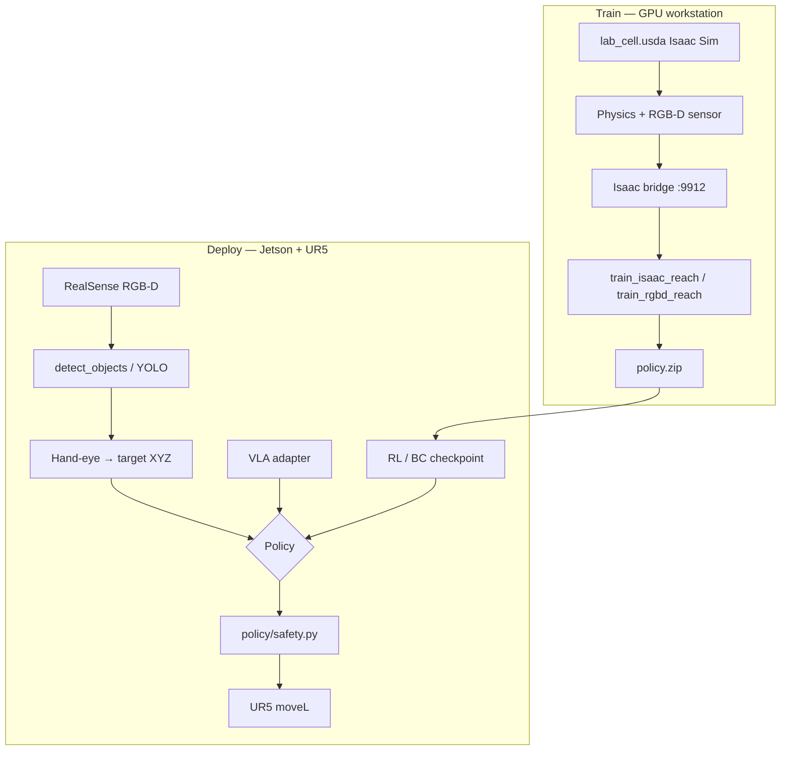

# 3D Camera + Isaac Sim + RL + VLA — Implementation Guide

How the full stack fits together **before** behavior-cloning (human demo) training.  
Related: [RL.md](RL.md), [IL.md](IL.md), [URDF_USD.md](URDF_USD.md), [TRAINING.md](TRAINING.md).

---

## North-star architecture



**Key idea:** Same action space everywhere — small Cartesian `[dx, dy, dz]` in base frame.  
What changes is **where observations come from** (real camera vs sim) and **who picks the action** (RL, VLA, or human demo).

---

## Two machines (typical)

| Machine | Role |
|---------|------|
| **Jetson + UR5** | RealSense, RTDE, agent, deploy inference |
| **GPU PC** | Isaac Sim, RL training, optional VLA server |

Isaac Sim does **not** run on the Jetson. Train on GPU; copy `policy.zip` to the robot PC.

---

## Layer-by-layer

### 1) 3D camera (real — already in repo)

| Step | Code |
|------|------|
| RGB-D capture | `camera/realsense_camera.py` → `capture_rgbd()` |
| Detection | `detect_objects` |
| Pixel + depth → base XYZ | `camera/geometry.py` + `hand_eye.json` |
| RL steps to target | `execute_rl_policy` task `camera_reach` |

Env: `CAMERA_DEPTH_ENABLED=true`, `HAND_EYE_CALIB_PATH=...`

### 2) Isaac Sim (digital twin)

| Step | Action |
|------|--------|
| Week 1 ✅ | URDF built — `assets/robots/ur5_robotiq/urdf/` |
| Week 2 | Import URDF + table in Isaac GUI |
| Week 2 | Add camera prim, random objects |
| Week 2 | Save `assets/usd/lab_cell.usda` |
| Week 3 | Run bridge — `scripts/isaac/run_isaac_bridge.py` |
| Week 3 | Train — `rl/train_isaac_reach.py` |

```bash
# GPU machine (Isaac python)
export REPO=/path/to/ur5_agentic_ai
$ISAAC_PYTHON $REPO/scripts/isaac/run_isaac_bridge.py --port 9912

# Same or other machine
cd ur5_agent && source robot_env/bin/activate
SIM_BACKEND=isaac python3 rl/train_isaac_reach.py --timesteps 100000
```

Until USD exists, bridge uses `LocalRgbdReachEnv` fallback so you can test the protocol.

### 3) RL in sim

| Script | Backend | Observation |
|--------|---------|-------------|
| `rl/train_reach.py` | Local toy sim | state only (12) — ✅ you trained this |
| `rl/train_rgbd_reach.py` | Local RGB-D sim | image + depth + state |
| `rl/train_isaac_reach.py` | Isaac bridge | state (images next) |

**Reward (reach):** negative distance TCP → target, bonus inside 8 mm.

Deploy: same `ReachPolicyRunner` + `execute_rl_policy`.

### 4) VLA (vision-language-action)

VLA = **image + language instruction → action**.

| Mode | `VLA_BACKEND` | Status |
|------|---------------|--------|
| Tool-routed baseline | `tool_routed` | ✅ keyword + 3D target |
| Disabled | `disabled` | no motion |
| OpenVLA (remote GPU) | `openvla` | ✅ `scripts/vla/serve_openvla.py` + `VLA_SERVER_URL` |
| π0 / openpi (remote GPU) | `pi0` | ✅ `scripts/vla/serve_pi0.py` |
| GR00T N1.5 (remote GPU) | `groot` | ✅ `scripts/vla/serve_groot.py` |

Remote backends fall back to a proportional stub when `VLA_SERVER_URL` is unset,
so the loop is testable without a GPU. Full setup: [scripts/vla/README.md](../scripts/vla/README.md).

```bash
# GPU host
python3 scripts/vla/serve_openvla.py --model openvla/openvla-7b --port 8000

# Robot
export VLA_BACKEND=openvla VLA_SERVER_URL=http://<gpu-host>:8000
python3 scripts/run_vla_reach_once.py --live \
  --instruction "reach the cup carefully" \
  --target-label cup \
  --steps 15
```

The VLA action is clipped to `VLA_MAX_STEP_M` and still passes through
`policy/safety.py` — the model never bypasses the safety layer.

**When a real VLA model pays off (vs tool_routed):**

1. Isaac + RL baseline works in sim  
2. Real 3D reach works with proportional/RL policy  
3. You need free-form language (“pick the red bag near the edge”)  
4. You have UR5 demos to fine-tune on — zero-shot VLA on an unseen rig is weak

Until then: **agent (Ollama) + tools** is your language layer; the VLA adapter is the plug-in point.

---

## Unified observation contract

`sim/obs_contract.py` defines modes used across real / sim / VLA:

| `ObsMode` | Contents |
|-----------|----------|
| `state` | joints(6) + tcp(3) + target(3) |
| `rgbd_state` | RGB + depth + state12 |
| `vla` | RGB + instruction + state12 |

---

## Recommended implementation order

```text
Phase A — Real 3D (now)
  □ hand_eye.json calibrated
  □ detect_objects returns target_base_m
  □ execute_rl_policy camera_reach live test

Phase B — Local sim RL (no Isaac yet)
  □ pip install gymnasium stable-baselines3 torch
  □ python3 rl/train_rgbd_reach.py
  □ eval in LocalRgbdReachEnv

Phase C — Isaac Sim
  □ Build lab_cell.usda in Isaac GUI
  □ run_isaac_bridge.py on GPU host
  □ train_isaac_reach.py SIM_BACKEND=isaac
  □ Export synthetic frames → data/synthetic/isaac/

Phase D — VLA (optional)
  □ run_vla_reach_once.py with tool_routed
  □ Later: OpenVLA server on GPU, set VLA_SERVER_URL

Phase E — Human demos (IL)
  □ record_demo.py + train_bc.py  (see IL.md)
```

**Do BC (imitation) after Phase A** — you want 3D targets and sim pipeline understood first.

---

## Code map (new)

| Path | Purpose |
|------|---------|
| `ur5_agent/sim/obs_contract.py` | Shared obs/action spec |
| `ur5_agent/sim/local_rgbd_reach_env.py` | Dev gym env without Isaac |
| `ur5_agent/sim/bridge.py` | TCP client for Isaac bridge |
| `ur5_agent/vla/adapter.py` | Image + text → dx,dy,dz |
| `ur5_agent/vla/remote_client.py` | HTTP client for GPU VLA servers |
| `scripts/vla/serve_openvla.py` | OpenVLA server (GPU host) |
| `scripts/vla/serve_pi0.py` | π0 / openpi server (GPU host) |
| `scripts/vla/serve_groot.py` | GR00T N1.5 server (GPU host) |
| `ur5_agent/rl/train_rgbd_reach.py` | RGB-D RL (local) |
| `ur5_agent/rl/train_isaac_reach.py` | RL via Isaac bridge |
| `scripts/isaac/run_isaac_bridge.py` | Server inside Isaac python |
| `scripts/run_vla_reach_once.py` | Deploy VLA + 3D loop |

---

## Isaac GUI checklist (lab_cell.usda)

1. Import `assets/robots/ur5_robotiq/urdf/ur5_robotiq.urdf`
2. Import `assets/cell/lab_table.urdf`, align with real table height
3. Add **Camera** prim (match RealSense FOV ~69° × 42°, 640×480)
4. Add **target object** (cube/cup mesh) with random pose on reset
5. Physics: UR5 position drives, table static collision
6. Save as `assets/usd/lab_cell.usda`
7. In `run_isaac_bridge.py`, replace `LocalRgbdReachEnv` hook with Isaac scene step

---

## VLA vs agent vs RL (decision)

| Approach | Language | Vision | Best for |
|----------|----------|--------|----------|
| **Agent + tools** | Ollama | detect_objects | Explainable ops, airport SOP |
| **RL policy** | No | state or RGB-D | Fast repeated reach motions |
| **VLA** | Built-in | End-to-end image | Research, unstructured commands |
| **BC demos** | No | state / RGB-D | Copy your lab motions |

**Practical default:** Agent plans → `detect_objects` → 3D target → RL policy executes.  
Add VLA only when tool routing is not enough.

---

## Environment variables

```bash
# 3D camera
export CAMERA_DEPTH_ENABLED=true
export HAND_EYE_CALIB_PATH=../data/calibration/hand_eye.json

# Isaac training
export SIM_BACKEND=isaac          # or local
export ISAAC_BRIDGE_HOST=192.168.1.50
export ISAAC_BRIDGE_PORT=9912
export ISAAC_USD_PATH=../assets/usd/lab_cell.usda

# VLA
export VLA_BACKEND=tool_routed    # tool_routed | openvla | pi0 | groot | disabled
export VLA_INSTRUCTION_DEFAULT="reach the object carefully"
export VLA_SERVER_URL=            # http://<gpu-host>:8000 (scripts/vla/serve_*.py)
export VLA_WIRE_FORMAT=ur5        # ur5 | openvla_native (official deploy.py)
export VLA_UNNORM_KEY=            # OpenVLA dataset key, e.g. bridge_orig
export VLA_ACTION_SCALE_M=0.01    # scale for normalized [-1,1] actions
```

---

## What “done” looks like

| Milestone | Proof |
|-----------|--------|
| 3D real reach | `camera_reach` trace shows `dist_m` decreasing |
| Local RGB-D RL | `reach_rgbd_v1/policy.zip` eval success |
| Isaac connected | `IsaacBridgeClient.ping()` OK |
| Isaac RL | `reach_isaac_v1/policy.zip` from bridge training |
| VLA deploy | `run_vla_reach_once.py` reaches object with instruction |
| Then IL | `record_demo.py` → `train_bc.py` |
